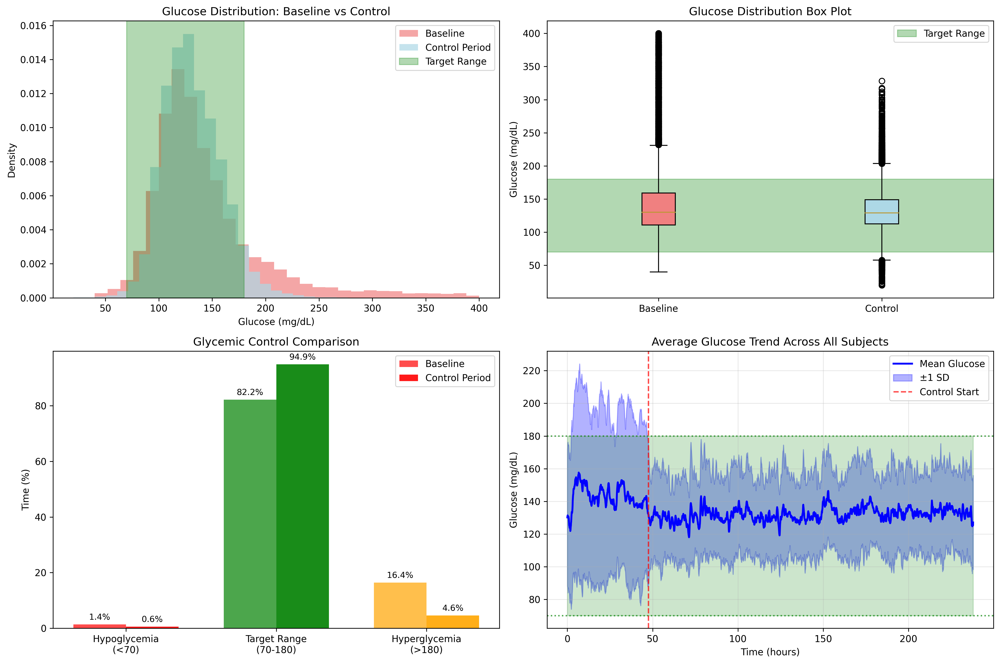
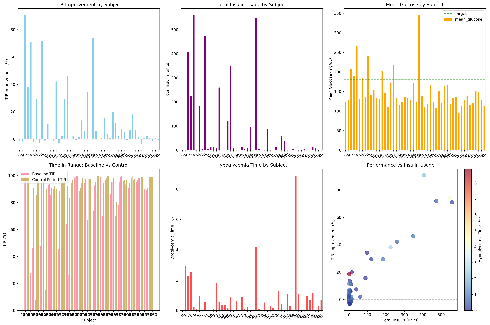
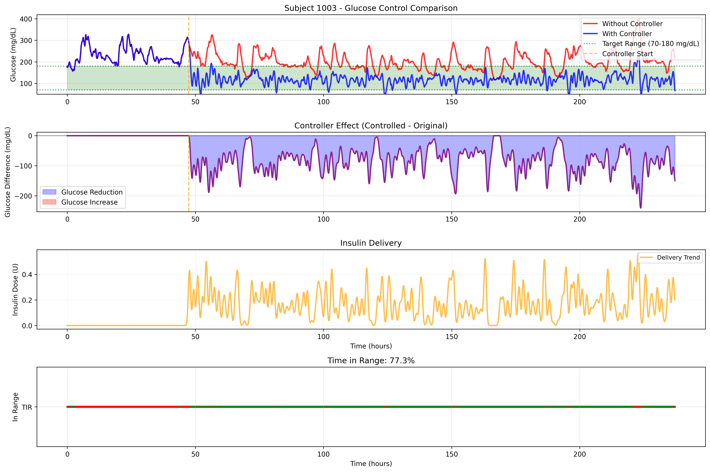
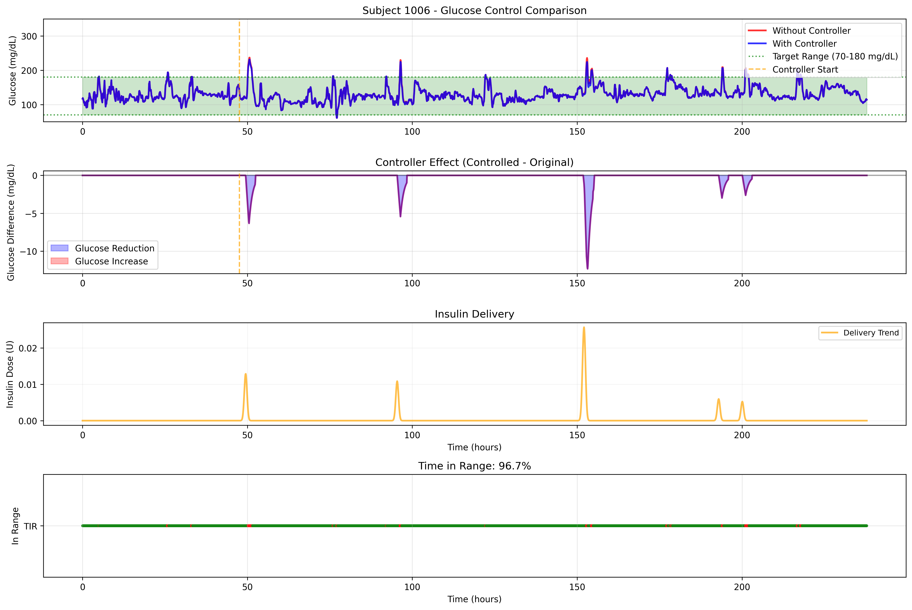
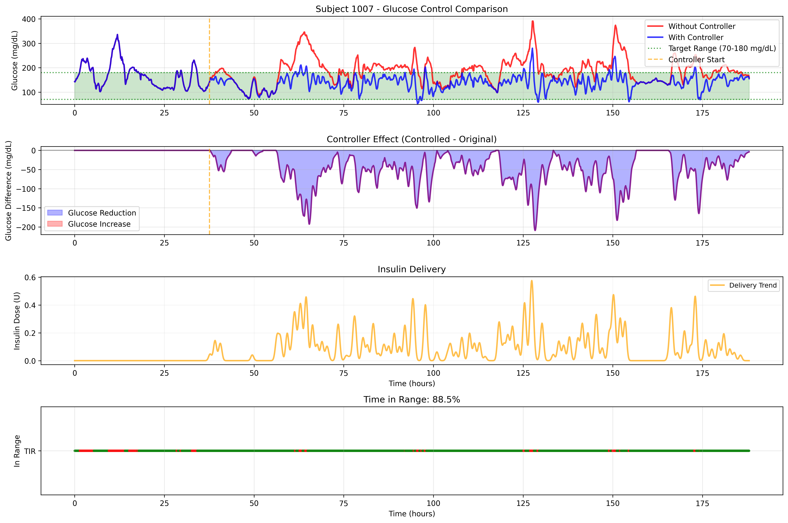
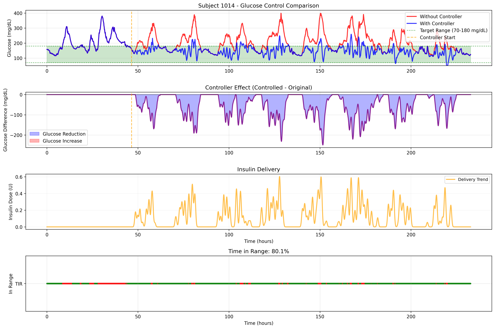
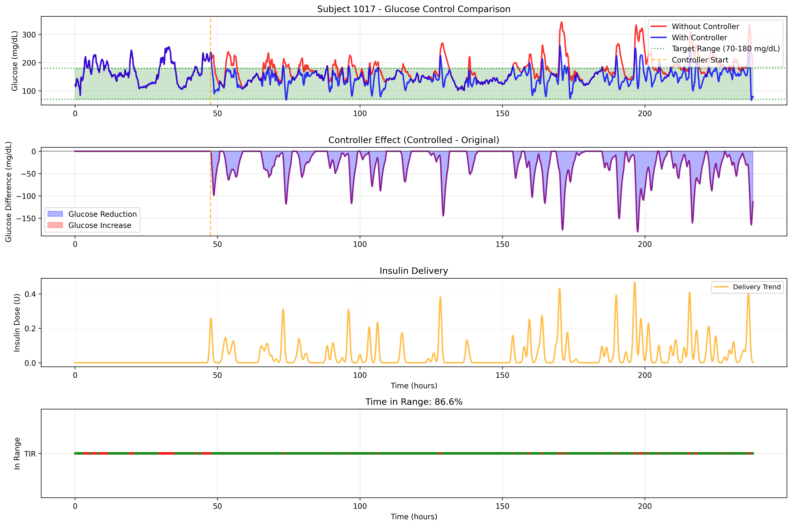

# cgmAID

Automated insulin delivery and meal detection algorithms based on continuous glucose monitoring (CGM) time-series data and food intake.

## Overview
This repository provides:
- A comprehensive algorithm for detecting meal times and estimating calories from CGM data.
- Model predictive control-based AID system Using Random Forest for glucose prediction.
- Adaptive Personalization based on Baseline time-in-range (TIR), Mean glucose levels and Glucose variability.

## Meal Detection Algorithm

The `meal_detection_algorithm.py` script implements a robust method to detect meal events and estimate their caloric content from CGM data. It includes:
- Glucose rate of change analysis
- Peak detection and classification
- Meal timing estimation
- Calorie estimation based on glucose response
- Meal type classification (breakfast, lunch, dinner, snack)

### Features
- Handles noisy and irregular CGM data
- Estimates meal times and types based on glucose dynamics
- Provides summary statistics and visualization for detected meals

### Usage
1. Prepare your CGM data as a CSV file with columns: `participant_id`, `timestamp`, `date`, `glucose_value`.
2. Run the script:
   ```bash
   python meal_detection_algorithm.py
   ```
3. The script will:
   - Preprocess the data
   - Detect meals for each participant
   - Save detected meals to `detected_meals.csv`
   - Print summary statistics
   - Plot an example of meal detection for a sample participant

## Automated Insulin Delivery Controller

The `aid_run.py` script provides a comprehensive automated insulin delivery system with machine learning-based glucose prediction and comprehensive visualizations. It includes:
- Advanced glucose prediction using Random Forest models
- Personalized insulin sensitivity and control parameters
- Realistic insulin action curve modeling
- Safety features (glucose thresholds, dosing limits, IOB tracking)
- Real-time glucose state modification based on insulin effects
- Comprehensive performance analysis and visualization

### Features
- **Glucose Prediction**: Machine learning model trained on CGM and food intake data
- **Personalized Control**: Adaptive parameters based on individual glucose patterns
- **Safety Systems**: Multiple safety checks including glucose thresholds and maximum dosing limits
- **Insulin Modeling**: Realistic insulin action curve with peak at 60 minutes and 3-hour duration
- **Performance Metrics**: Time in range (TIR), hypoglycemia time, hyperglycemia time analysis
- **Comprehensive Visualizations**: Individual subject traces, summary statistics, performance dashboards

### Usage
Run the script with your CGM and food intake data:
```bash
python aid_run.py
```

The script will:
- Load CGM and meal data from `aireadi_cgm_kcal.csv`
- Train glucose prediction models for each subject
- Simulate automated insulin delivery with real-time glucose modification
- Generate comprehensive visualizations including:
  - Individual subject glucose traces with and without controller
  - Controller performance summary statistics
  - Glucose distribution analysis
  - Performance dashboard with safety metrics
  - Insulin action curve visualization
- Save results to CSV and PNG files in the `aireadi/` folder

## Requirements
- Python 3.10.18
- numpy
- pandas
- scipy
- matplotlib
- scikit-learn
- seaborn

Install dependencies with:
```bash
pip install numpy pandas scipy matplotlib scikit-learn seaborn
```

## Figures

Below are example figures generated by the cgmAID project:

**Meal Detection Summary**


**Glucose Distribution Analysis**



**Controller Summary Statistics**



**Subject 1003 CGM, Meals and Automated Insulin Delivery Traces**



**Subject 1006 CGM, Meals and Automated Insulin Delivery Traces**



**Subject 1007 CGM, Meals and Automated Insulin Delivery Traces**



**Subject 1012 CGM, Meals and Automated Insulin Delivery Traces**


**Subject 1014 CGM, Meals and Automated Insulin Delivery Traces**



**Subject 1017 CGM, Meals and Automated Insulin Delivery Traces**



## License
See the [LICENSE](LICENSE) file for license information.
